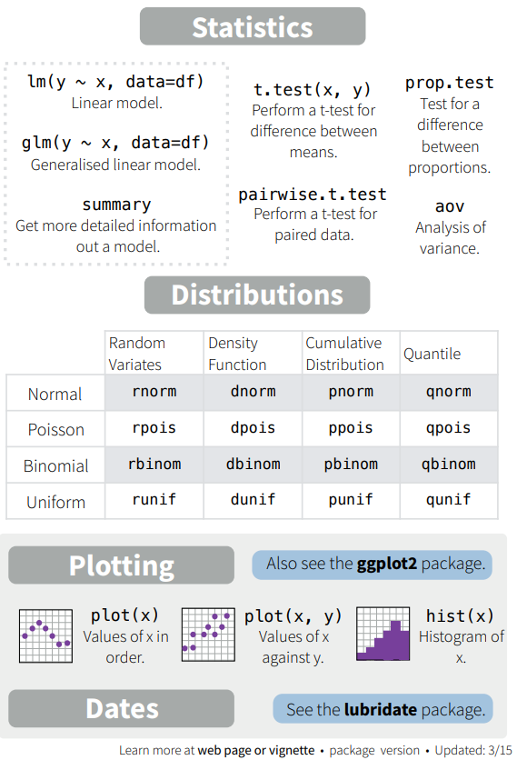
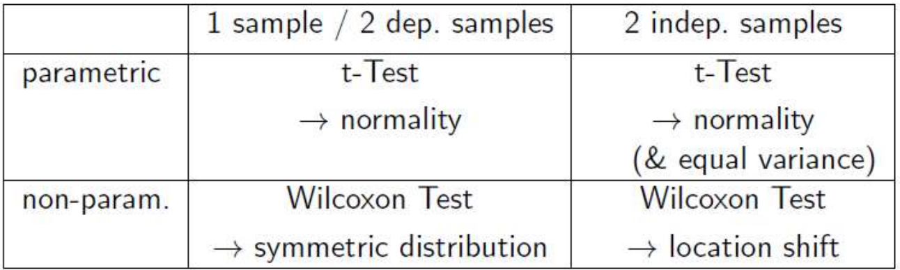
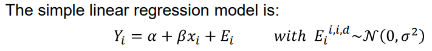
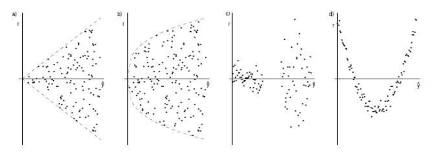
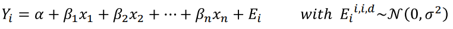

```{r setup, include=FALSE}
knitr::opts_chunk$set(echo = TRUE)
# tinytex::install_tinytex()
# library(tinytex)
```

# Introduction

## R Markdown Preamble

This is an R Markdown document. Markdown is a simple formatting syntax for authoring HTML, PDF, and MS Word documents. For more details on using R Markdown see <http://rmarkdown.rstudio.com>.

See also the [**R Markdown Cookbook**](https://bookdown.org/yihui/rmarkdown-cookbook/))

When you click the **Knit** button a document will be generated that includes both content as well as the output of any embedded R code chunks within the document. You can embed an R code chunk like this:

## Sample Inbuilt Data Set

```{r cars}
summary(cars)
```

## Including Plots - Example

### Embed Plot

You can also embed plots, for example:

```{r pressure, echo=FALSE}
plot(pressure)
```

Note that the `echo = FALSE` parameter was added to the code chunk to prevent printing of the R code that generated the plot.

### Another Plot

Let's create another Test plot

```{r, test-plot }
plot(cars,  col = "red", xlab = "Speed (mph)", ylab = "Distance (miles)" )
```

A summary of the data frame is given below

```{r, cars-summary}
pacman::p_load(knitr)
kable(summary(cars))
```

# Start of My SHC 798 R-code

## R basics

1.  Why install [**Rtools**](https://cran.r-project.org/bin/windows/Rtools/)?

2.  R Shiny [**Gallery**](http://shiny.rstudio.com/gallery/): There's Shiny for R and Shiny for Python

## R Operations 1

What can be done?

```{r, Operations-1}

# R as a calculator
sqrt(12)
x <- 3
y <- x^2
x+y

# Creating Vectors
v1 <- c(1,5, 80)
v1
v2 <- 2:11
v2
a <- c(1,6,10,22,7,13)
mean(a)

# Incomplete Statement
3*(4 +
     +2)
#Assignments and Function Calls
t.a <- 3*(4+2)
t.b <- t.a + 2.5
mn <- mean(c(t.a,t.b))
mn
```

## R Help

Resources

1.  Very useful and helpful [**R Q&A Website**](http://stackexchange.com/)

2.  Paradis 2005 - R for Beginners [Textbook]

3.  R Reference Card [in the notes, 6 pages - Material from *R for Beginners*]

4.  Base R Cheat Sheet [in the notes, 2 pages]

5.  Venables et al 2017 - An introduction to R [Textbook]

6.  [**R for Data Science, r4ds**](https://r4ds.had.co.nz/index.html) or the [**r4ds-2e**](https://r4ds.hadley.nz/)

7.  [**W^3^Schools**](https://www.w3schools.com/r/default.asp) R Certification



## R Operations 2

### Importing Data sets

```{r, Operations-2}
# Import Data: Website
url <- "https://stat.ethz.ch/Teaching/Datasets/WBL/sport.dat"
d.sport <- read.table(url, header = TRUE)
head(d.sport)

# Setting the Working Directory
# Use:
getwd() #Prints the current working directory
# setwd("D:/2025 MEng Transportation/SHC 798 R-Proj") ~ Sets the working directory
# Alternatively, use “Session” → “Set Working Directory” → “Choose Directory…”
# Import Data: Files
  # - Different ways depending on the format (csv, txt, xlsx, etc.) 
  # - Alternative: use the “Import Dataset” tool in RStudio (upper-right panel)
# Save data or write data to a file
  # - Text files
  # - Excel files: use CSV
```

### R Objects & Indexing

```{r, Indexing}
# R Objects: Data frames (Most essential)
str(d.sport)

# R Objects: Vectors
  # (e.g., a column from the data set d.sport)
kugel <- d.sport$kugel
str(kugel)

participant <- rownames(d.sport)
str(participant)

# Select elements
participant[4]
d.sport[c(3,6,4), c(1:3,7)]
d.sport["FRITZ", ]

# Accessing Parts of an Object
# To access only part of an object, use []
  # For vectors: myvector[x]
  # For two-dimensional objects, e.g. data frames or matrices: mydata.frame[x,y]
d.sport[ , ]
c(1,3,7)
1:10
d.sport[1:10, ]
d.sport[-c(1, 3,7), ] #negative indices are excluded
d.sport[ , 2:3]
d.sport[c(1,3,6), 2:3]

# Function Calls
mean(kugel)
quantile(kugel)
quantile(kugel,probs = c(.75, 0.9))

# Functions consist of mandatory and optional arguments:
  # mean(x, trim = 0, na.rm = FALSE, …)
  # x: mandatory argument
  # trim: optional argument, default is 0
  # na.rm: optional argument, default is FALSE

# The arguments of a function have a defined order and each argument has its own unique name
mean(x = kugel, na.rm = TRUE)
mean(x = kugel, ,TRUE)

# Useful Functions
nrow(d.sport)
ncol(d.sport)
dim(d.sport)
summary(d.sport)
# apply(d.sport)
head(d.sport)
tail(d.sport)
```

### R Packages

```{r, packages}
#install.packages("MASS")
#require(MASS) # for every R Session
#library(MASS) # or use this
```

Online resources: University of Pretoria \| SHC 798 \| Introduction to R 36

o List of all packages: <http://cran.r-project.org/web/packages/>

o By topic: <http://cran.r-project.org/web/views/>

o Ask Google / ChatGPT / GroK

### Missing Values

```{r, Missing-values}
d.sport.NA <- d.sport
d.sport.NA[2, "kugel"] <- NA 
d.sport.NA[3, "hoch"] <- -999
# missing values are coded as NA (not available) and are treated in a special way, e.g. is.na():
is.na(d.sport.NA) #one logical value per element
sum(is.na(d.sport.NA)) # adds up the TRUE elements
which(is.na(d.sport.NA), arr.ind = TRUE) # where are the NA's

# Specify missing values after reading in the data:
d.sport.NA[d.sport.NA == -999] <- NA

# Many functions have an argument to handle missing values, e.g. na.rm, na.omit:
sum(d.sport.NA$kugel)
sum(d.sport.NA$kugel, na.rm = TRUE)
na.omit(d.sport.NA)

```

## Basic Graphics

```{r, Plots}
# The Plot Function: only 1 mandatory argument i.e., x. The 2nd most important one is y. 
  # many optional arguments [col,pch,main,cex, ...]
  # use function par (?par) to set or query graphical parameters

data(iris)
iris
str(iris)
# A factor represents categorical values with different "levels"
# High-level plotting function: opens a plot
plot(x = iris$Sepal.Width, y =iris$Sepal.Length, col = iris[ , "Species"], pch = 19)

#Low-level plotting functions: add to an existing plot
legend("topright", legend = levels(iris[ , "Species"]), pch = 19, col = 1:3) # adds legend

# In an Rmd file such as this one, you need to call both the plot() & legend() functions at the same time. Or they should be in the same line of code

pairs(iris[ , -5], col = iris[ , 5])
```

### Arguments of plot


**Three categories of R graphics functions:**

• High-level plotting functions such as plot() to generate a new graphics display.

• Low-level plotting functions such as legend() to add further graphical elements to an existing plot.

• Interactive functions such as identify() to amend or collect information interactively from a plot.

**Low-level plotting functions**


**Useful plot functions**

-   plot, pairs, interaction.plot
-   boxplot, hist
-   plot3d

### Graphical Output

```{r, G-Output}
pdf(file = "iris_plot.pdf") # open the graphics device
plot(Sepal.Length ~ Sepal.Width, data = iris)
# add anything else you want in your plots
dev.off() #close the graphic device
```

Several plots in one graphical window: splits the graphical window into 3 rows and 2 columns.

```{r, several_plots}
par(mfrow=c(3,2))
```

**Other Graphics: in lattice**

The lattice package functions: good for repeating graphs for various groups. See the [**Lattice Graphs in R**](http://www.statmethods.net/advgraphs/trellis.html) (at <http://www.statmethods.net/advgraphs/trellis.html>) for more information.

```{r, lattice}
pacman::p_load(lattice)
xyplot(Sepal.Width ~ Sepal.Length | Species, data = iris)
```

**Other Graphics: in ggplot2**

[**ggplot2**](https://ggplot2.org) package: very flexible, based on grammar of graphics.

```{r, ggplot2}
pacman::p_load(ggplot2)
ggplot(data = iris, aes(x = Sepal.Length, y = Sepal.Width)) + facet_grid(rows = ~ Species) + geom_point()
```

## Hypothesis Testing

Approach: Hypothesis testing in 6 steps:

1.  Declare *model* by which data were generated (e.g. population is normally distributed, large sample size and σ not known).
2.  Define null hypothesis, **H~0~** and alternative hypothesis, **H~A~** ; where **H~0~** is the statement being tested in a test of (statistical) significance and **H~A~** is the statement that is hoped or expected to be true instead of the null hypothesis
3.  Choose the *level of significance*, α.
4.  Determine *critical values* for the \*level of significance α and *degrees of freedom*, df = (n-1)
5.  Define and calculate **test statistic**, e.g. one-sample test:
6.  **Compare** the test statistic to the **critical values** and make **decision** to **reject** or **fail to reject** H~0~ .

Hypothesis Tests – An Example

```{r, HT-1-sample}
# Is the sepal length of versicolor different to that of virginica?
#Let’s use a *t-Test and a *Wilcoxon rank-sum test.
testdata <- iris[iris$Species != "setosa", c("Sepal.Length", "Species")]
testdata$Species <- droplevels(testdata$Species)
str(testdata) # prepare and check the data

# Check normality assumption of t-Test using QQ-Plot:
versi.id <- testdata$Species == "versicolor"
par(mfrow=c(1,2))
qqnorm(testdata$Sepal.Length[versi.id]); qqline(testdata$Sepal.Length[versi.id])
qqnorm(testdata$Sepal.Length[!versi.id]); qqline(testdata$Sepal.Length[versi.id])
```

```{r, HT-2-Sample}
# Two-sample t-test:
versi.id <- testdata$Species == "versicolor"
t.test(x =testdata$Sepal.Length[versi.id], y = testdata$Sepal.Length[!versi.id], var.equal = TRUE)
# T-test rejects the null hypothesis at 5% significance level.
# Do not forget to visually check the normality assumptions (QQ-plot)
```

```{r, Wilcoxon}
# Check assumption of \*Wilcoxon Rank Test: same distribution, just a location shift.
boxplot(testdata$Sepal.Length ~ testdata$Species)
# Now, perform the test:
versi.id <- testdata$Species == "versicolor"
wilcox.test(x =testdata$Sepal.Length[versi.id], y = testdata$Sepal.Length[!versi.id], var.equal = TRUE)
# Wilcoxon Rank Test also rejects the null hypothesis at 5% significance level. 
```

The **Wilcoxon Rank Test** is the *preferred* test for a two-sample statistical test.

### Hypothesis Tests - Summary

How to proceed:

-   Formulate the null & alternative hypotheses
-   Choose the appropriate test
-   Collate data, i.e., do an experiment
-   Look at data: plot(), pairs(), hist(), boxplot()
-   Validate assumptions of test (e.g., T-test, Wilcoxon test)
-   Carry out the test and interpret result



Hypothesis Tests – **Chi-squared test of independence**

-   Hypothesis: H~0~: Independence of education and marriage status
-   H~A~: Dependence of education and marriage status

```{r, Chi-sq}
url <- "https://stat.ethz.ch/Teaching/Datasets/edu.txt"
d.edu <- read.table(url, header = TRUE)

# Cross-tables in R
# Count number of cases with same value:
table(d.edu[, "Married"])

# Cross-table
table(d.edu[, "Education"], d.edu[, "Married"])

# Now we perform a Chi-squared test
chisq.test(d.edu[, "Education"], d.edu[, "Married"])

# Result: Reject H0, i.e. education and marriage are dependent.
```

## Correlation

```{r, Correlation}
# Correlation
url1 <- "https://stat.ethz.ch/Teaching/Datasets/basischOhneNA.dat"
d.basisch <- read.table(url1, header = TRUE)
str(d.basisch)

# Calculate the (Pearson) correlation of ph and height:
cor(d.basisch$ph, d.basisch$height)

# Corresponding plot:
plot(d.basisch$ph, d.basisch$height)
```

All plots show 2 variables with a correlation of 0.7

-   one looks good
-   another does not
-   outlier(s) influence the result
-   ALWAYS FIRST LOOK AT PLOTS

## Regression

### Simple Linear Regression (SLR)

From the d.basisch() data,

1.  **Response variable**: *height* or h.quad: Height of trees or squared height, respectively.
2.  **Possible explanatory variables**: *ph*: pH-values of soil and l.sar: log(sodium absorption ratio)



Let us pick the variable ph as the explanatory variable.

```{r, SLR}
# Fit to data using lm:
fit <- lm(formula = height ~ ph, data = d.basisch)
summary(fit)
# Estimated equation: height = 28.7 – 3.0pH

# Drawing line into scatterplot:
plot(d.basisch$ph, d.basisch$height) + abline(fit)
```

#### SLR - Residual Analysis

Diagnostics plots are straightforward:

```{r, SLR-Resid1}
par(mfrow = c(2,2))
plot(fit)
```

1.  Tukey-Anscombe plot (is the variance of the errors Ei constant? Is the regression function correct?)
2.  Q-Q plot (are the errors Ei normally distributed?)
3.  Scale location plot (similar to Tukey-Anscombe plot)
4.  Leverage plot (what points have a strong influence on the fit?)

Residual plots by hand:

```{r, SLR-Resid2}
par(mfrow = c(1,2))
plot(fit$fitted,fit$resid) 

#Tukey-Anscombe
qqnorm(fit$resid) #Quantile-Quantile Plot
qqline(fit$resid) # adds the diagonal line
```



### Multiple Linear Regression

Expand the simple linear model to more than one explanatory variable.



```{r, MLR}
# Fit the model with lm
fitm <- lm(height ~ ph + l.sar, data = d.basisch)
summary(fitm)
```

#### MLR - Residual Analysis

```{r, MLR-Resid}
# Look at the same plots as for simple linear regression
plot(fitm)

# It may help to plot the explanatory variables against the residuals.
plot(d.basisch$ph, fitm$resid)
plot(d.basisch$l.sar, fitm$resid)
```

# Other

## Graphics - Demo

```{r, Graphics}
demo(graphics)

demo(image)

demo(persp)

pacman::p_load(scatterplot3d); example(scatterplot3d)

example(points)

```
